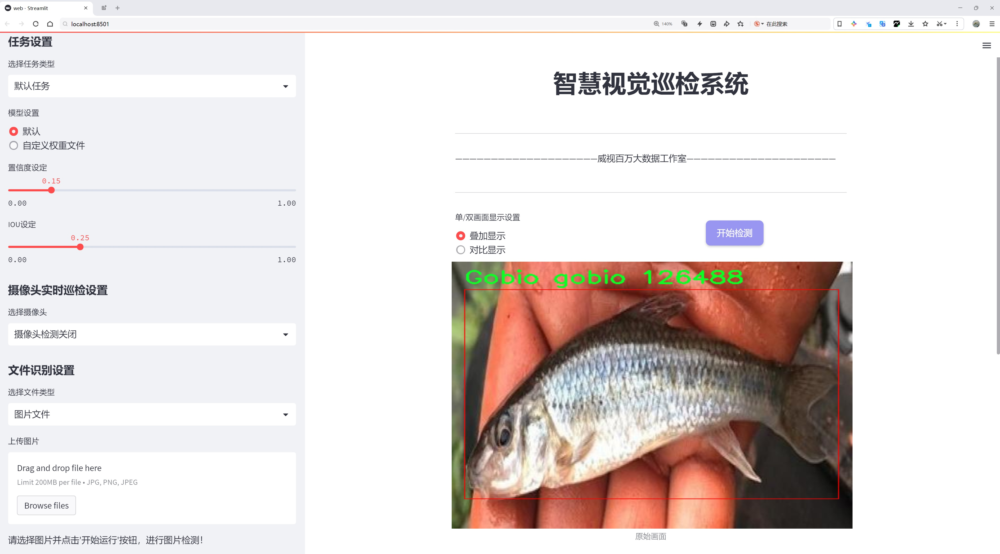
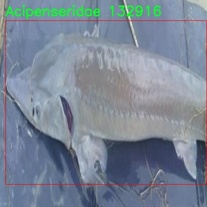

# 鱼类目标检测检测系统源码分享
 # [一条龙教学YOLOV8标注好的数据集一键训练_70+全套改进创新点发刊_Web前端展示]

### 1.研究背景与意义

项目参考[AAAI Association for the Advancement of Artificial Intelligence](https://gitee.com/qunmasj/projects)

研究背景与意义

随着全球水域生态环境的变化，鱼类作为水域生态系统的重要组成部分，其种群变化和生物多样性受到越来越多的关注。鱼类的种类繁多，涵盖了从淡水到海洋的多种栖息环境，具有重要的生态、经济和社会价值。然而，传统的鱼类监测方法往往依赖于人工观察和捕捞，这不仅耗时耗力，而且难以全面、准确地评估鱼类种群的分布和数量。因此，开发高效、准确的鱼类目标检测系统，成为了水产科学研究和生态保护的重要任务。

近年来，深度学习技术的迅猛发展为目标检测领域带来了革命性的变化，尤其是YOLO（You Only Look Once）系列模型因其高效性和实时性而广泛应用于各种目标检测任务。YOLOv8作为该系列的最新版本，进一步提升了检测精度和速度，成为研究者们关注的焦点。然而，针对特定领域的目标检测，尤其是鱼类的检测，仍然面临着诸多挑战，如背景复杂性、鱼类种类繁多、个体差异显著等。因此，基于改进YOLOv8的鱼类目标检测系统的研究具有重要的理论和实践意义。

本研究所使用的数据集包含7480张图像，涵盖30个鱼类类别，包括常见的淡水鱼和一些经济价值较高的鱼类。这一丰富的数据集为模型的训练和验证提供了坚实的基础。通过对这些数据的深入分析，可以有效提升模型对不同鱼类的识别能力，进而提高检测的准确性和鲁棒性。此外，数据集中多样化的鱼类种类和复杂的背景环境，为模型的改进提供了良好的实验平台，能够帮助研究者探索更为有效的特征提取和分类方法。

在生态保护和水产管理方面，基于改进YOLOv8的鱼类目标检测系统能够为鱼类种群监测、生态评估和资源管理提供科学依据。通过自动化的检测手段，可以实现对鱼类种群动态变化的实时监测，为生态保护措施的制定和实施提供数据支持。同时，该系统还可以应用于水产养殖、渔业资源评估等领域，助力可持续发展。

综上所述，基于改进YOLOv8的鱼类目标检测系统的研究，不仅具有重要的学术价值，还对实际应用具有深远的影响。通过提升鱼类目标检测的准确性和效率，能够为水域生态保护和资源管理提供有力支持，推动相关领域的研究和实践向前发展。

### 2.图片演示





##### 注意：由于此博客编辑较早，上面“2.图片演示”和“3.视频演示”展示的系统图片或者视频可能为老版本，新版本在老版本的基础上升级如下：（实际效果以升级的新版本为准）

  （1）适配了YOLOV8的“目标检测”模型和“实例分割”模型，通过加载相应的权重（.pt）文件即可自适应加载模型。

  （2）支持“图片识别”、“视频识别”、“摄像头实时识别”三种识别模式。

  （3）支持“图片识别”、“视频识别”、“摄像头实时识别”三种识别结果保存导出，解决手动导出（容易卡顿出现爆内存）存在的问题，识别完自动保存结果并导出到。

  （4）支持Web前端系统中的标题、背景图等自定义修改，后面提供修改教程。

  另外本项目提供训练的数据集和训练教程,暂不提供权重文件（best.pt）,需要您按照教程进行训练后实现图片演示和Web前端界面演示的效果。

### 3.视频演示

[3.1 视频演示](https://www.bilibili.com/video/BV11DW2eZEsZ/?vd_source=ff015de2d29cbe2a9cdbfa7064407a08)

### 4.数据集信息展示

数据集信息展示

本数据集专为改进YOLOv8的鱼类目标检测系统而设计，包含了丰富的鱼类图像数据，旨在为研究人员和开发者提供一个高质量的训练基础。数据集的总图像数量达到了7480张，涵盖了30个不同的鱼类类别，展现了水生生态系统的多样性和复杂性。这些图像不仅为模型训练提供了充足的样本，还确保了模型在实际应用中的泛化能力。

在类别方面，数据集包括了多种鱼类，如常见的淡水鱼和一些特定的鱼种。例如，Abramis brama（白鲤）、Acipenseridae（鲟鱼科）、Anguilla anguilla（欧洲鳗鱼）等，都是生态系统中重要的组成部分。其他类别如Cyprinus carpio（鲤鱼）、Esox lucius（北方梭鱼）和Salmo trutta subsp-fario（普通鳟鱼）等，代表了不同的栖息环境和生物特性。这种多样性不仅丰富了数据集的内容，也为目标检测模型提供了多种鱼类的特征和形态信息，有助于提高模型的识别准确率。

每一类鱼类的图像均经过精心挑选，确保在不同的光照、角度和背景下都有良好的表现。这些图像的质量和多样性为YOLOv8模型的训练提供了坚实的基础，使其能够在实际应用中更好地识别和分类不同种类的鱼类。数据集的构建考虑到了鱼类在自然环境中的多样性，因此包含了不同水域、不同季节和不同活动状态下的鱼类图像，这将极大地增强模型的鲁棒性。

此外，数据集的使用遵循CC BY 4.0许可证，允许用户在遵循相关规定的前提下自由使用和分享。这一开放的许可协议促进了学术界和工业界的合作，鼓励更多的研究者和开发者参与到鱼类目标检测技术的研发中来。通过共享数据集，研究人员可以更方便地进行实验和验证，推动相关领域的进步。

总之，这个鱼类目标检测数据集不仅为YOLOv8模型的训练提供了丰富的图像数据，还为研究人员提供了一个良好的平台，以探索和开发更先进的目标检测技术。随着对水生生物保护和生态研究的重视，鱼类目标检测技术的进步将为环境监测、渔业管理和生态保护等领域带来重要的应用价值。通过不断优化和改进检测系统，我们期待能够更好地理解和保护水生生态系统中的生物多样性。




### 5.全套项目环境部署视频教程（零基础手把手教学）

[5.1 环境部署教程链接（零基础手把手教学）](https://www.ixigua.com/7404473917358506534?logTag=c807d0cbc21c0ef59de5)


[5.2 安装Python虚拟环境创建和依赖库安装视频教程链接（零基础手把手教学）](https://www.ixigua.com/7404474678003106304?logTag=1f1041108cd1f708b01a)

### 6.手把手YOLOV8训练视频教程（零基础小白有手就能学会）

[6.1 环境部署教程链接（零基础手把手教学）](https://www.ixigua.com/7404477157818401292?logTag=d31a2dfd1983c9668658)

### 7.70+种全套YOLOV8创新点代码加载调参视频教程（一键加载写好的改进模型的配置文件）

[7.1 环境部署教程链接（零基础手把手教学）](https://www.ixigua.com/7404478314661806627?logTag=29066f8288e3f4eea3a4)

### 8.70+种全套YOLOV8创新点原理讲解（非科班也可以轻松写刊发刊，V10版本正在科研待更新）

由于篇幅限制，每个创新点的具体原理讲解就不一一展开，具体见下列网址中的创新点对应子项目的技术原理博客网址【Blog】：


[8.1 70+种全套YOLOV8创新点原理讲解链接](https://gitee.com/qunmasj/good)

### 9.系统功能展示（检测对象为举例，实际内容以本项目数据集为准）

图1.系统支持检测结果表格显示

  图2.系统支持置信度和IOU阈值手动调节

  图3.系统支持自定义加载权重文件best.pt(需要你通过步骤5中训练获得)

  图4.系统支持摄像头实时识别

  图5.系统支持图片识别

  图6.系统支持视频识别

  图7.系统支持识别结果文件自动保存

  图8.系统支持Excel导出检测结果数据


### 10.原始YOLOV8算法原理

原始YOLOv8算法原理

YOLOv8是Ultralytics公司在2023年推出的目标检测算法，它在前几代YOLO模型的基础上进行了重要的改进和优化，旨在提高目标检测的准确性和速度。YOLOv8的设计理念是快速、准确且易于使用，使其在目标检测、图像分割和图像分类等任务中表现出色。该算法的核心在于其独特的网络结构，包括输入层、主干网络、颈部网络和头部网络等部分。

在输入层，YOLOv8采用了640x640的默认图像尺寸，然而，考虑到实际应用中图像的长宽比往往各不相同，YOLOv8引入了自适应图片缩放技术。这种技术的核心思想是将图像的长边按比例缩小到指定尺寸，然后对短边进行填充，以尽量减少填充区域带来的信息冗余。这种方法不仅提高了目标检测的速度，还在一定程度上保留了图像的关键信息。此外，在模型训练阶段，YOLOv8使用了Mosaic图像增强技术，通过随机将四张图像进行缩放和拼接，生成新的训练样本。这种增强方式使得模型能够学习到不同位置和周围像素的变化，从而有效提高了模型的预测精度和鲁棒性。

YOLOv8的主干网络部分是其性能提升的关键所在。该部分借鉴了YOLOv7中的ELAN模块设计思想，将YOLOv5中的C3模块替换为C2F模块。C2F模块通过并行化更多的梯度流分支，在保证轻量化的同时，获取了更丰富的梯度信息，从而提高了模型的精度和响应速度。相较于C3模块，C2F模块在结构上更加灵活，能够适应不同规模的模型需求，进一步提升了YOLOv8的性能。

在颈部网络中，YOLOv8同样进行了重要的改进。该部分不仅将C3模块替换为C2F模块，还去除了两次上采样之前的1x1卷积连接层，直接对主干网络不同阶段输出的特征进行上采样。这种简化的结构设计使得特征融合更加高效，减少了计算量，同时提升了特征的表达能力。

YOLOv8的头部网络是其最显著的创新之一。与YOLOv5的Coupled-Head结构不同，YOLOv8采用了Decoupled-Head结构，将检测和分类任务解耦。具体而言，输入特征图首先通过两个1x1卷积模块进行降维，然后分别生成两个分支，一个用于类别预测，另一个用于边界框位置和IoU（交并比）预测。这种解耦设计使得模型在处理不同任务时能够更加专注，进而提高了整体性能。

此外，YOLOv8抛弃了传统的Anchor-Based方法，转而采用Anchor-Free的检测方式。这一创新使得目标检测不再依赖于预设的锚框，而是将目标检测问题转化为关键点检测。这种方法不仅简化了网络结构，还提高了模型的泛化能力，能够更灵活地适应不同的数据集和目标物体的变化。通过这种方式，YOLOv8能够更高效地处理不同大小和形状的目标，提高了检测的准确性和召回率。

在损失函数的设计上，YOLOv8也进行了相应的调整。为了克服在训练和推理过程中存在的逻辑不一致性，YOLOv8的头部网络中取消了Obj分支。在分类分支中，依然采用了二值交叉熵损失（BCELoss），而在边界框回归分支中则使用了分布焦点损失（DFL）和CIoU损失。这种损失函数的设计旨在使网络模型能够快速聚焦于标签附近的数值，从而提高目标检测的精度。

总的来说，YOLOv8在多个方面进行了创新和优化，提升了目标检测的性能和灵活性。通过引入自适应图片缩放、Mosaic图像增强、C2F模块、Decoupled-Head结构以及Anchor-Free检测方法，YOLOv8不仅在准确性上取得了显著提升，同时也在计算效率上表现出色。这些改进使得YOLOv8成为了一个强大的工具，适用于各种复杂的目标检测任务，为计算机视觉领域的发展提供了新的动力。


### 11.项目核心源码讲解（再也不用担心看不懂代码逻辑）

#### 11.1 ultralytics\models\fastsam\prompt.py

以下是经过精简和注释的核心代码部分，保留了最重要的功能和逻辑：

```python
import os
import numpy as np
import torch
from PIL import Image
import cv2
from ultralytics.utils import TQDM

class FastSAMPrompt:
    """
    Fast Segment Anything Model 类，用于图像注释和可视化。
    """

    def __init__(self, source, results, device="cuda") -> None:
        """初始化 FastSAMPrompt，设置源图像、结果和计算设备。"""
        self.device = device
        self.results = results
        self.source = source

        # 导入 CLIP 模型
        try:
            import clip
        except ImportError:
            from ultralytics.utils.checks import check_requirements
            check_requirements("git+https://github.com/openai/CLIP.git")
            import clip
        self.clip = clip

    @staticmethod
    def _segment_image(image, bbox):
        """根据提供的边界框坐标对图像进行分割。"""
        image_array = np.array(image)
        segmented_image_array = np.zeros_like(image_array)
        x1, y1, x2, y2 = bbox
        segmented_image_array[y1:y2, x1:x2] = image_array[y1:y2, x1:x2]
        segmented_image = Image.fromarray(segmented_image_array)
        black_image = Image.new("RGB", image.size, (255, 255, 255))
        transparency_mask = np.zeros((image_array.shape[0], image_array.shape[1]), dtype=np.uint8)
        transparency_mask[y1:y2, x1:x2] = 255
        transparency_mask_image = Image.fromarray(transparency_mask, mode="L")
        black_image.paste(segmented_image, mask=transparency_mask_image)
        return black_image

    @staticmethod
    def _format_results(result, filter=0):
        """将检测结果格式化为包含 ID、分割、边界框、分数和面积的注释列表。"""
        annotations = []
        n = len(result.masks.data) if result.masks is not None else 0
        for i in range(n):
            mask = result.masks.data[i] == 1.0
            if torch.sum(mask) >= filter:
                annotation = {
                    "id": i,
                    "segmentation": mask.cpu().numpy(),
                    "bbox": result.boxes.data[i],
                    "score": result.boxes.conf[i],
                }
                annotation["area"] = annotation["segmentation"].sum()
                annotations.append(annotation)
        return annotations

    def plot(self, annotations, output):
        """
        在图像上绘制注释、边界框，并保存输出。
        """
        pbar = TQDM(annotations, total=len(annotations))
        for ann in pbar:
            result_name = os.path.basename(ann.path)
            image = ann.orig_img[..., ::-1]  # BGR 转 RGB
            plt.figure(figsize=(image.shape[1] / 100, image.shape[0] / 100))
            plt.imshow(image)

            if ann.masks is not None:
                masks = ann.masks.data
                for mask in masks:
                    mask = cv2.morphologyEx(mask.astype(np.uint8), cv2.MORPH_CLOSE, np.ones((3, 3), np.uint8))
                    plt.imshow(mask, alpha=0.5)  # 叠加掩膜

            # 保存图像
            save_path = os.path.join(output, result_name)
            plt.axis("off")
            plt.savefig(save_path, bbox_inches="tight", pad_inches=0, transparent=True)
            plt.close()
            pbar.set_description(f"Saving {result_name} to {save_path}")

    @torch.no_grad()
    def retrieve(self, model, preprocess, elements, search_text: str) -> int:
        """处理图像和文本，计算相似度并返回 softmax 分数。"""
        preprocessed_images = [preprocess(image).to(self.device) for image in elements]
        tokenized_text = self.clip.tokenize([search_text]).to(self.device)
        stacked_images = torch.stack(preprocessed_images)
        image_features = model.encode_image(stacked_images)
        text_features = model.encode_text(tokenized_text)
        image_features /= image_features.norm(dim=-1, keepdim=True)
        text_features /= text_features.norm(dim=-1, keepdim=True)
        probs = 100.0 * image_features @ text_features.T
        return probs[:, 0].softmax(dim=0)

    def text_prompt(self, text):
        """处理文本提示，应用于现有结果并返回更新的结果。"""
        if self.results[0].masks is not None:
            format_results = self._format_results(self.results[0], 0)
            cropped_boxes, _, _, _, annotations = self._crop_image(format_results)
            clip_model, preprocess = self.clip.load("ViT-B/32", device=self.device)
            scores = self.retrieve(clip_model, preprocess, cropped_boxes, text)
            max_idx = scores.argsort()[-1]  # 获取最高分的索引
            self.results[0].masks.data = torch.tensor(np.array([annotations[max_idx]["segmentation"]]))
        return self.results

    def _crop_image(self, format_results):
        """根据提供的注释格式裁剪图像并返回裁剪后的图像和相关数据。"""
        image = Image.fromarray(cv2.cvtColor(self.results[0].orig_img, cv2.COLOR_BGR2RGB))
        annotations = format_results
        cropped_boxes = []
        for mask in annotations:
            if np.sum(mask["segmentation"]) <= 100:
                continue
            bbox = self._get_bbox_from_mask(mask["segmentation"])  # 从掩膜获取边界框
            cropped_boxes.append(self._segment_image(image, bbox))  # 保存裁剪图像
        return cropped_boxes, annotations

    @staticmethod
    def _get_bbox_from_mask(mask):
        """从掩膜中获取边界框。"""
        mask = mask.astype(np.uint8)
        contours, _ = cv2.findContours(mask, cv2.RETR_EXTERNAL, cv2.CHAIN_APPROX_SIMPLE)
        x1, y1, w, h = cv2.boundingRect(contours[0])
        x2, y2 = x1 + w, y1 + h
        for b in contours[1:]:
            x_t, y_t, w_t, h_t = cv2.boundingRect(b)
            x1 = min(x1, x_t)
            y1 = min(y1, y_t)
            x2 = max(x2, x_t + w_t)
            y2 = max(y2, y_t + h_t)
        return [x1, y1, x2, y2]

    def everything_prompt(self):
        """返回类中处理的结果。"""
        return self.results
```

### 代码注释说明：
1. **类的初始化**：`__init__` 方法中初始化了设备、结果和源图像，并导入了 CLIP 模型。
2. **图像分割**：`_segment_image` 方法根据边界框对图像进行分割，并返回分割后的图像。
3. **结果格式化**：`_format_results` 方法将检测结果格式化为包含注释信息的列表。
4. **绘图方法**：`plot` 方法在图像上绘制注释和掩膜，并保存结果。
5. **检索方法**：`retrieve` 方法处理图像和文本，计算相似度并返回分数。
6. **文本提示**：`text_prompt` 方法根据文本提示更新结果。
7. **裁剪图像**：`_crop_image` 方法根据注释裁剪图像并返回裁剪后的图像。
8. **获取边界框**：`_get_bbox_from_mask` 方法从掩膜中提取边界框。

以上是代码的核心部分和详细注释，便于理解其功能和逻辑。

这个文件定义了一个名为 `FastSAMPrompt` 的类，主要用于图像注释和可视化，结合了图像分割和 CLIP 模型的功能。该类的主要功能是处理图像分割结果，并根据用户的输入（如边界框、点或文本提示）进行相应的调整。

在初始化方法中，类接受源图像、分割结果和计算设备（如 CUDA 或 CPU）。它还尝试导入 CLIP 模型，以便进行线性分配。如果导入失败，则会检查并安装相关依赖。

类中包含多个静态方法和实例方法。静态方法 `_segment_image` 用于根据给定的边界框从图像中提取区域，并生成一个透明背景的图像。`_format_results` 方法将检测结果格式化为包含 ID、分割掩码、边界框、置信度分数和面积的注释列表。`_get_bbox_from_mask` 方法则通过对掩码进行形态学变换来获取边界框。

`plot` 方法用于在图像上绘制注释、边界框和点，并将结果保存到指定的输出目录。它使用 `matplotlib` 进行可视化，并支持多种参数以调整绘图效果，例如是否使用随机颜色、是否绘制轮廓等。

`fast_show_mask` 方法则是在给定的 matplotlib 轴上快速显示掩码注释。它支持随机颜色和透明度设置，并可以绘制边界框和点。

`retrieve` 方法使用 CLIP 模型处理图像和文本，计算相似度并返回 softmax 分数。`_crop_image` 方法根据提供的注释格式裁剪图像，并返回裁剪后的图像和相关数据。

`box_prompt` 方法允许用户通过边界框调整掩码，并计算掩码与边界框之间的交并比（IoU）。`point_prompt` 方法则根据用户输入的点调整检测到的掩码。`text_prompt` 方法处理文本提示，应用于现有结果并返回更新后的结果。

最后，`everything_prompt` 方法返回类中处理后的结果。整个类的设计旨在提供灵活的图像分割和注释功能，适用于需要图像处理和分析的应用场景。

#### 11.2 ultralytics\engine\predictor.py

以下是代码中最核心的部分，并附上详细的中文注释：

```python
class BasePredictor:
    """
    BasePredictor类。

    这是一个用于创建预测器的基类。

    属性:
        args (SimpleNamespace): 预测器的配置。
        save_dir (Path): 保存结果的目录。
        done_warmup (bool): 预测器是否完成初始化。
        model (nn.Module): 用于预测的模型。
        data (dict): 数据配置。
        device (torch.device): 用于预测的设备。
        dataset (Dataset): 用于预测的数据集。
    """

    def __init__(self, cfg=DEFAULT_CFG, overrides=None, _callbacks=None):
        """
        初始化BasePredictor类。

        参数:
            cfg (str, optional): 配置文件的路径。默认为DEFAULT_CFG。
            overrides (dict, optional): 配置覆盖。默认为None。
        """
        self.args = get_cfg(cfg, overrides)  # 获取配置
        self.save_dir = get_save_dir(self.args)  # 获取保存目录
        if self.args.conf is None:
            self.args.conf = 0.25  # 默认置信度为0.25
        self.done_warmup = False  # 初始化完成标志
        self.model = None  # 模型初始化为None
        self.device = None  # 设备初始化为None
        self.dataset = None  # 数据集初始化为None
        self.callbacks = _callbacks or callbacks.get_default_callbacks()  # 获取回调函数

    def preprocess(self, im):
        """
        在推理之前准备输入图像。

        参数:
            im (torch.Tensor | List(np.ndarray)): 输入图像，支持张量或列表格式。
        
        返回:
            torch.Tensor: 处理后的图像张量。
        """
        not_tensor = not isinstance(im, torch.Tensor)  # 检查输入是否为张量
        if not_tensor:
            im = np.stack(self.pre_transform(im))  # 预处理图像
            im = im[..., ::-1].transpose((0, 3, 1, 2))  # 转换颜色通道从BGR到RGB
            im = np.ascontiguousarray(im)  # 确保数组是连续的
            im = torch.from_numpy(im)  # 转换为张量

        im = im.to(self.device)  # 将图像移动到指定设备
        im = im.half() if self.model.fp16 else im.float()  # 转换数据类型
        if not_tensor:
            im /= 255  # 将像素值归一化到0.0 - 1.0
        return im

    def inference(self, im, *args, **kwargs):
        """对给定图像进行推理。"""
        return self.model(im, *args, **kwargs)  # 使用模型进行推理

    def stream_inference(self, source=None, model=None, *args, **kwargs):
        """实时推理并将结果保存到文件。"""
        if not self.model:
            self.setup_model(model)  # 设置模型

        # 设置数据源
        self.setup_source(source if source is not None else self.args.source)

        # 预热模型
        if not self.done_warmup:
            self.model.warmup(imgsz=(1, 3, *self.imgsz))  # 预热模型
            self.done_warmup = True

        for batch in self.dataset:  # 遍历数据集
            im = self.preprocess(batch[1])  # 预处理图像
            preds = self.inference(im, *args, **kwargs)  # 进行推理
            self.results = self.postprocess(preds, im, batch[1])  # 后处理结果

            # 可视化、保存和写入结果
            for i in range(len(batch[1])):
                self.write_results(i, self.results, batch)  # 写入结果

    def setup_model(self, model, verbose=True):
        """使用给定参数初始化YOLO模型并设置为评估模式。"""
        self.model = AutoBackend(
            model or self.args.model,
            device=select_device(self.args.device, verbose=verbose),
            fp16=self.args.half,
            fuse=True,
            verbose=verbose,
        )
        self.device = self.model.device  # 更新设备
        self.model.eval()  # 设置模型为评估模式

    def write_results(self, idx, results, batch):
        """将推理结果写入文件或目录。"""
        # 处理结果并保存
        # 这里省略具体实现
```

### 代码说明
1. **BasePredictor类**：这是一个用于YOLO模型推理的基类，包含了模型的初始化、预处理、推理和结果写入等核心功能。
2. **__init__方法**：初始化配置、保存目录和其他属性。
3. **preprocess方法**：对输入图像进行预处理，包括颜色通道转换和归一化。
4. **inference方法**：使用模型对预处理后的图像进行推理。
5. **stream_inference方法**：实现实时推理，处理输入源并输出结果。
6. **setup_model方法**：初始化YOLO模型并设置为评估模式。
7. **write_results方法**：将推理结果写入文件或目录。

这些核心部分构成了YOLO模型进行图像推理的基础框架。

这个程序文件是Ultralytics YOLO模型的预测器实现，主要用于在图像、视频、目录、流媒体等多种来源上进行目标检测。文件中包含了一个名为`BasePredictor`的类，该类负责设置模型、处理输入数据、执行推理以及保存和展示结果。

在类的初始化方法中，首先通过`get_cfg`函数获取配置参数，并设置保存结果的目录。接着，初始化了一些重要的属性，例如模型、数据集、设备等。程序还检查了是否需要显示图像，并为多线程推理设置了锁。

`preprocess`方法用于在推理前对输入图像进行处理，包括将图像转换为张量格式、调整数据类型等。`inference`方法则调用模型进行推理，并根据配置决定是否可视化结果。`write_results`方法负责将推理结果写入文件或目录，并可选择性地将边界框绘制到图像上。

`stream_inference`方法是该类的核心，用于实时流媒体推理。它会在每个批次上执行预处理、推理和后处理，并在必要时保存结果或显示图像。该方法还会记录每个步骤的时间，以便进行性能分析。

`setup_model`方法用于初始化YOLO模型并设置为评估模式。`show`方法使用OpenCV显示图像，而`save_preds`方法则负责将视频预测结果保存为文件。

此外，程序还支持回调机制，可以在特定事件发生时执行用户定义的函数，提供了灵活的扩展性。

总体来说，这个文件实现了YOLO模型的预测功能，支持多种输入来源和输出格式，并提供了丰富的配置选项以满足不同的需求。

#### 11.3 ui.py

```python
import sys
import subprocess

def run_script(script_path):
    """
    使用当前 Python 环境运行指定的脚本。

    Args:
        script_path (str): 要运行的脚本路径

    Returns:
        None
    """
    # 获取当前 Python 解释器的路径
    python_path = sys.executable

    # 构建运行命令
    command = f'"{python_path}" -m streamlit run "{script_path}"'

    # 执行命令
    result = subprocess.run(command, shell=True)
    if result.returncode != 0:
        print("脚本运行出错。")


# 实例化并运行应用
if __name__ == "__main__":
    # 指定您的脚本路径
    script_path = "web.py"  # 这里直接指定脚本名称

    # 运行脚本
    run_script(script_path)
```

### 代码注释说明：

1. **导入模块**：
   - `import sys`：导入系统相关的模块，用于获取当前 Python 解释器的路径。
   - `import subprocess`：导入子进程模块，用于在 Python 中执行外部命令。

2. **定义函数 `run_script`**：
   - 函数接收一个参数 `script_path`，表示要运行的 Python 脚本的路径。
   - 使用 `sys.executable` 获取当前 Python 解释器的路径，以确保使用正确的 Python 环境来运行脚本。
   - 构建一个命令字符串 `command`，该命令将使用 `streamlit` 模块运行指定的脚本。
   - 使用 `subprocess.run` 执行构建的命令，并通过 `shell=True` 允许在 shell 中执行命令。
   - 检查命令的返回码，如果不为 0，表示脚本运行出错，打印错误信息。

3. **主程序块**：
   - 使用 `if __name__ == "__main__":` 确保只有在直接运行该脚本时才会执行以下代码。
   - 指定要运行的脚本路径，这里简化为直接使用脚本名称 `"web.py"`。
   - 调用 `run_script` 函数来执行指定的脚本。

这个程序文件的主要功能是使用当前的 Python 环境来运行一个指定的脚本，具体是一个名为 `web.py` 的文件。程序首先导入了必要的模块，包括 `sys`、`os` 和 `subprocess`，这些模块分别用于系统操作、路径处理和执行外部命令。

在 `run_script` 函数中，首先获取当前 Python 解释器的路径，使用 `sys.executable` 可以得到这个路径。接着，构建一个命令字符串，这个命令使用 `streamlit` 模块来运行指定的脚本。`streamlit` 是一个用于构建数据应用的库，`-m` 参数表示以模块的方式运行。

随后，使用 `subprocess.run` 方法来执行这个命令。这个方法会在一个新的 shell 中运行命令，并等待命令执行完成。执行完后，程序会检查返回码，如果返回码不为零，表示脚本运行出错，程序会输出一条错误信息。

在文件的最后部分，使用 `if __name__ == "__main__":` 语句来确保只有在直接运行该文件时才会执行后面的代码。这里指定了要运行的脚本路径 `web.py`，并调用 `run_script` 函数来执行这个脚本。

总的来说，这个程序的作用是方便地通过当前 Python 环境来运行一个 Streamlit 应用脚本，并处理可能出现的错误。

#### 11.4 ultralytics\data\explorer\explorer.py

以下是经过简化并添加详细中文注释的核心代码部分：

```python
from ultralytics.models.yolo.model import YOLO
from ultralytics.data.dataset import YOLODataset
from ultralytics.data.utils import check_det_dataset
from pandas import DataFrame
from tqdm import tqdm

class ExplorerDataset(YOLODataset):
    def __init__(self, *args, data: dict = None, **kwargs) -> None:
        # 初始化数据集，调用父类构造函数
        super().__init__(*args, data=data, **kwargs)

    def load_image(self, i: int) -> Union[Tuple[np.ndarray, Tuple[int, int], Tuple[int, int]], Tuple[None, None, None]]:
        """从数据集中加载索引为 'i' 的图像，不进行任何调整大小操作。"""
        im, f, fn = self.ims[i], self.im_files[i], self.npy_files[i]
        if im is None:  # 如果图像未缓存于内存中
            if fn.exists():  # 如果存在npy文件，加载它
                im = np.load(fn)
            else:  # 否则读取图像文件
                im = cv2.imread(f)  # 读取为BGR格式
                if im is None:
                    raise FileNotFoundError(f"未找到图像 {f}")
            h0, w0 = im.shape[:2]  # 获取原始高度和宽度
            return im, (h0, w0), im.shape[:2]  # 返回图像及其尺寸信息

        return self.ims[i], self.im_hw0[i], self.im_hw[i]  # 返回缓存的图像和尺寸信息

class Explorer:
    def __init__(self, data: Union[str, Path] = "coco128.yaml", model: str = "yolov8n.pt", uri: str = "~/ultralytics/explorer") -> None:
        # 检查所需的库是否已安装
        checks.check_requirements(["lancedb>=0.4.3", "duckdb"])
        import lancedb

        # 连接到LanceDB数据库
        self.connection = lancedb.connect(uri)
        self.table_name = Path(data).name.lower() + "_" + model.lower()  # 生成表名
        self.model = YOLO(model)  # 加载YOLO模型
        self.data = data  # 数据集路径
        self.choice_set = None  # 选择的数据集
        self.table = None  # 数据表
        self.progress = 0  # 进度

    def create_embeddings_table(self, force: bool = False, split: str = "train") -> None:
        """
        创建包含数据集中图像嵌入的LanceDB表。如果表已存在，将重用它。
        """
        if self.table is not None and not force:
            LOGGER.info("表已存在，重用它。若要覆盖，请传递force=True。")
            return
        if self.table_name in self.connection.table_names() and not force:
            LOGGER.info(f"表 {self.table_name} 已存在，重用它。若要覆盖，请传递force=True。")
            self.table = self.connection.open_table(self.table_name)
            self.progress = 1
            return
        if self.data is None:
            raise ValueError("必须提供数据以创建嵌入表")

        data_info = check_det_dataset(self.data)  # 检查数据集信息
        if split not in data_info:
            raise ValueError(f"数据集中未找到分割 {split}。可用的键为 {list(data_info.keys())}")

        choice_set = data_info[split]
        choice_set = choice_set if isinstance(choice_set, list) else [choice_set]
        self.choice_set = choice_set
        dataset = ExplorerDataset(img_path=choice_set, data=data_info, augment=False, cache=False, task=self.model.task)

        # 创建表模式
        batch = dataset[0]
        vector_size = self.model.embed(batch["im_file"], verbose=False)[0].shape[0]  # 获取嵌入向量的维度
        table = self.connection.create_table(self.table_name, schema=get_table_schema(vector_size), mode="overwrite")
        table.add(
            self._yield_batches(
                dataset,
                data_info,
                self.model,
                exclude_keys=["img", "ratio_pad", "resized_shape", "ori_shape", "batch_idx"],
            )
        )

        self.table = table  # 保存创建的表

    def query(self, imgs: Union[str, np.ndarray, List[str], List[np.ndarray]] = None, limit: int = 25) -> Any:
        """
        查询表以获取相似图像。接受单个图像或图像列表。
        """
        if self.table is None:
            raise ValueError("表未创建。请先创建表。")
        if isinstance(imgs, str):
            imgs = [imgs]  # 将单个图像转换为列表
        assert isinstance(imgs, list), f"img必须是字符串或字符串列表。得到的是 {type(imgs)}"
        embeds = self.model.embed(imgs)  # 获取图像的嵌入向量
        embeds = torch.mean(torch.stack(embeds), 0).cpu().numpy() if len(embeds) > 1 else embeds[0].cpu().numpy()  # 计算平均嵌入
        return self.table.search(embeds).limit(limit).to_arrow()  # 查询相似图像并返回结果

    def get_similar(self, img: Union[str, np.ndarray, List[str], List[np.ndarray]] = None, limit: int = 25) -> Union[DataFrame, Any]:
        """
        查询表以获取相似图像，返回结果为DataFrame或Arrow表。
        """
        img = self._check_imgs_or_idxs(img)  # 检查图像或索引
        similar = self.query(img, limit=limit)  # 查询相似图像
        return similar.to_pandas()  # 返回结果为DataFrame

    def _check_imgs_or_idxs(self, img: Union[str, np.ndarray, List[str], List[np.ndarray], None]) -> List[np.ndarray]:
        """检查输入的图像或索引的有效性。"""
        if img is None:
            raise ValueError("必须提供图像或索引。")
        return img if isinstance(img, list) else [img]  # 确保返回列表

```

### 代码说明
1. **ExplorerDataset类**: 继承自YOLODataset，主要用于加载图像和构建数据转换。
   - `load_image`方法用于加载指定索引的图像，并返回图像及其尺寸信息。

2. **Explorer类**: 主要用于处理数据集和查询相似图像。
   - `__init__`方法用于初始化连接到LanceDB数据库，加载YOLO模型等。
   - `create_embeddings_table`方法用于创建包含图像嵌入的数据库表。
   - `query`方法用于查询相似图像。
   - `get_similar`方法用于获取与给定图像相似的图像，并返回结果。

3. **_check_imgs_or_idxs方法**: 用于验证输入的图像或索引，确保返回一个图像列表。

以上代码保留了核心功能，并添加了详细的中文注释以便理解。

这个程序文件是一个用于图像数据集探索和查询的工具，主要用于与YOLO（You Only Look Once）模型结合，处理图像数据的嵌入和相似性查询。文件中定义了两个主要的类：`ExplorerDataset`和`Explorer`。

`ExplorerDataset`类继承自`YOLODataset`，用于加载和处理数据集中的图像。它重写了`load_image`方法，以便从数据集中加载图像而不进行任何缩放操作。该方法会检查图像是否已缓存，如果没有，则尝试从指定路径读取图像或加载Numpy数组文件。`build_transforms`方法用于创建图像的转换操作，确保图像的格式和特征符合模型的要求。

`Explorer`类是整个工具的核心，负责连接到LanceDB数据库并管理图像的嵌入和查询。它的构造函数接受数据集路径、模型路径和数据库URI等参数，并进行必要的检查。`create_embeddings_table`方法用于创建一个包含图像嵌入的数据库表，如果表已经存在且未强制覆盖，则会重用该表。它会检查数据集的有效性，并通过`ExplorerDataset`类加载数据集。

在嵌入生成过程中，`_yield_batches`方法会逐批处理数据集，提取图像的嵌入向量，并将其存储到数据库中。`query`方法允许用户根据输入的图像查询相似图像，返回相似图像的结果。`sql_query`方法则允许用户使用SQL风格的查询语言在数据库中执行查询，支持返回不同格式的结果（如Pandas DataFrame或Arrow表）。

此外，`Explorer`类还提供了一些可视化和报告生成的方法，如`plot_sql_query`和`plot_similarity_index`，用于可视化查询结果和相似性索引。`get_similar`和`plot_similar`方法则用于获取和可视化与输入图像相似的图像。

该类还包含一些辅助方法，例如`_check_imgs_or_idxs`用于验证输入的图像或索引，`ask_ai`方法允许用户通过自然语言查询获取图像数据的过滤结果。

总的来说，这个程序文件提供了一套完整的工具，方便用户对图像数据集进行探索、查询和可视化，结合YOLO模型的强大能力，帮助用户更好地理解和分析图像数据。

#### 11.5 train.py

以下是代码中最核心的部分，并附上详细的中文注释：

```python
import os
import torch
import yaml
from ultralytics import YOLO  # 导入YOLO模型库
from QtFusion.path import abs_path  # 导入获取绝对路径的函数

# 设置设备为GPU（如果可用），否则使用CPU
device = "0" if torch.cuda.is_available() else "cpu"

if __name__ == '__main__':  # 确保该模块被直接运行时才执行以下代码
    workers = 1  # 设置数据加载的工作进程数量
    batch = 2    # 设置每个批次的大小

    data_name = "data"  # 数据集名称
    # 获取数据集配置文件的绝对路径
    data_path = abs_path(f'datasets/{data_name}/{data_name}.yaml', path_type='current')  
    unix_style_path = data_path.replace(os.sep, '/')  # 将路径转换为Unix风格

    # 获取数据集所在目录的路径
    directory_path = os.path.dirname(unix_style_path)
    
    # 读取YAML格式的数据集配置文件
    with open(data_path, 'r') as file:
        data = yaml.load(file, Loader=yaml.FullLoader)
    
    # 如果配置文件中有'path'项，则修改为数据集目录路径
    if 'path' in data:
        data['path'] = directory_path
        # 将修改后的数据写回YAML文件
        with open(data_path, 'w') as file:
            yaml.safe_dump(data, file, sort_keys=False)

    # 加载YOLOv8模型，指定模型配置文件和任务类型
    model = YOLO(model='./ultralytics/cfg/models/v8/yolov8s.yaml', task='detect')  
    
    # 开始训练模型
    results2 = model.train(
        data=data_path,  # 指定训练数据的配置文件路径
        device=device,  # 指定使用的设备（GPU或CPU）
        workers=workers,  # 指定数据加载的工作进程数量
        imgsz=640,  # 指定输入图像的大小为640x640
        epochs=100,  # 指定训练的轮数为100
        batch=batch,  # 指定每个批次的大小
        name='train_v8_' + data_name  # 指定训练任务的名称
    )
```

### 代码核心部分说明：
1. **设备选择**：通过 `torch.cuda.is_available()` 判断是否有可用的GPU，如果有则使用GPU，否则使用CPU。
2. **数据集路径处理**：使用 `abs_path` 函数获取数据集配置文件的绝对路径，并将其转换为Unix风格的路径。
3. **YAML文件读取与修改**：读取数据集的YAML配置文件，如果存在`path`项，则更新为数据集的目录路径，并将修改后的内容写回文件。
4. **模型加载与训练**：加载YOLOv8模型，并使用指定的参数开始训练，包括数据路径、设备、工作进程数量、图像大小、训练轮数和批次大小。

这个程序文件`train.py`的主要功能是使用YOLOv8模型进行目标检测的训练。首先，程序导入了必要的库，包括`os`、`torch`、`yaml`和`ultralytics`中的YOLO模型。接着，程序通过检查CUDA是否可用来确定使用GPU还是CPU进行训练。

在`__main__`块中，程序设置了一些训练参数，包括工作进程数和批次大小。然后，定义了数据集的名称为`data`，并构建了数据集配置文件的绝对路径。这里使用了`abs_path`函数来获取路径，并将路径中的分隔符统一为Unix风格。

接下来，程序获取了数据集目录的路径，并打开对应的YAML文件以读取数据集的配置。在读取后，程序检查配置中是否包含`path`项，如果有，则将其修改为数据集的目录路径，并将更新后的数据写回YAML文件中。

随后，程序加载了YOLOv8的预训练模型，指定了模型的配置文件路径。然后，调用模型的`train`方法开始训练，传入了训练所需的参数，包括数据配置文件路径、设备、工作进程数、输入图像大小、训练的epoch数量、批次大小以及训练任务的名称。

总的来说，这段代码的主要流程是设置训练环境、准备数据集配置、加载YOLOv8模型，并启动训练过程。通过这些步骤，用户可以方便地对指定的数据集进行目标检测模型的训练。

#### 11.6 ultralytics\models\yolo\obb\val.py

以下是经过简化和注释的核心代码部分：

```python
# 导入必要的库
from pathlib import Path
import torch
from ultralytics.models.yolo.detect import DetectionValidator
from ultralytics.utils import ops
from ultralytics.utils.metrics import OBBMetrics, batch_probiou
from ultralytics.utils.plotting import output_to_rotated_target, plot_images

class OBBValidator(DetectionValidator):
    """
    OBBValidator类用于基于定向边界框（OBB）模型的验证。
    """

    def __init__(self, dataloader=None, save_dir=None, pbar=None, args=None, _callbacks=None):
        """初始化OBBValidator并将任务设置为'obb'，度量标准设置为OBBMetrics。"""
        super().__init__(dataloader, save_dir, pbar, args, _callbacks)
        self.args.task = "obb"  # 设置任务类型为OBB
        self.metrics = OBBMetrics(save_dir=self.save_dir, plot=True, on_plot=self.on_plot)  # 初始化度量标准

    def postprocess(self, preds):
        """对预测输出应用非极大值抑制（NMS）。"""
        return ops.non_max_suppression(
            preds,
            self.args.conf,  # 置信度阈值
            self.args.iou,   # IOU阈值
            labels=self.lb,
            nc=self.nc,
            multi_label=True,
            agnostic=self.args.single_cls,
            max_det=self.args.max_det,
            rotated=True,    # 处理旋转框
        )

    def _process_batch(self, detections, gt_bboxes, gt_cls):
        """
        返回正确的预测矩阵。

        参数:
            detections (torch.Tensor): 形状为[N, 6]的检测张量，每个检测格式为: x1, y1, x2, y2, conf, class。
            gt_bboxes (torch.Tensor): 真实边界框张量。

        返回:
            (torch.Tensor): 形状为[N, 10]的正确预测矩阵，表示10个IOU水平。
        """
        # 计算IOU
        iou = batch_probiou(gt_bboxes, torch.cat([detections[:, :4], detections[:, -1:]], dim=-1))
        return self.match_predictions(detections[:, 5], gt_cls, iou)  # 匹配预测与真实标签

    def plot_predictions(self, batch, preds, ni):
        """在输入图像上绘制预测的边界框并保存结果。"""
        plot_images(
            batch["img"],
            *output_to_rotated_target(preds, max_det=self.args.max_det),  # 获取旋转目标
            paths=batch["im_file"],
            fname=self.save_dir / f"val_batch{ni}_pred.jpg",  # 保存文件名
            names=self.names,
            on_plot=self.on_plot,
        )

    def eval_json(self, stats):
        """评估YOLO输出的JSON格式并返回性能统计信息。"""
        if self.args.save_json and len(self.jdict):
            import json
            from collections import defaultdict

            pred_json = self.save_dir / "predictions.json"  # 预测结果文件
            pred_txt = self.save_dir / "predictions_txt"  # 保存预测文本文件
            pred_txt.mkdir(parents=True, exist_ok=True)  # 创建目录

            data = json.load(open(pred_json))  # 加载JSON数据
            # 保存分割结果
            for d in data:
                image_id = d["image_id"]
                score = d["score"]
                classname = self.names[d["category_id"]].replace(" ", "-")
                p = d["poly"]

                # 将结果写入文本文件
                with open(f'{pred_txt / f"Task1_{classname}"}.txt', "a") as f:
                    f.writelines(f"{image_id} {score} {' '.join(map(str, p))}\n")

        return stats  # 返回统计信息
```

### 代码注释说明：
1. **导入部分**：导入所需的库和模块。
2. **类定义**：`OBBValidator`类继承自`DetectionValidator`，用于处理OBB模型的验证。
3. **初始化方法**：设置任务类型和度量标准。
4. **后处理方法**：对模型预测结果应用非极大值抑制（NMS），以减少冗余检测。
5. **批处理方法**：计算预测与真实标签之间的匹配情况，返回IOU矩阵。
6. **绘图方法**：将预测结果绘制在输入图像上并保存。
7. **评估方法**：将预测结果以JSON格式评估并保存为文本文件。

这个程序文件 `val.py` 是 Ultralytics YOLO 模型的一部分，专门用于基于有向边界框（Oriented Bounding Box, OBB）模型的验证。它继承自 `DetectionValidator` 类，主要负责处理验证过程中的数据准备、预测后处理、结果评估等功能。

首先，文件导入了一些必要的库和模块，包括路径处理、PyTorch、检测验证器、日志记录、操作工具、度量标准和绘图工具等。`OBBValidator` 类的构造函数初始化了一些参数，设置任务为 "obb"，并初始化了度量标准 `OBBMetrics`，用于评估模型的性能。

在 `init_metrics` 方法中，验证器会初始化评估指标，并检查数据集是否为 DOTA 格式。`postprocess` 方法则应用非极大值抑制（Non-Maximum Suppression, NMS）来处理预测输出，以减少冗余的检测框。

`_process_batch` 方法处理一批检测结果，计算与真实边界框的交并比（IoU），并返回正确的预测矩阵。`_prepare_batch` 方法准备并返回用于 OBB 验证的批次数据，包括类标签、边界框、原始形状等信息。`_prepare_pred` 方法则对预测结果进行缩放和填充，以适应原始图像的尺寸。

在 `plot_predictions` 方法中，程序将预测的边界框绘制在输入图像上，并保存结果。`pred_to_json` 方法将 YOLO 的预测结果序列化为 COCO JSON 格式，以便于后续处理和评估。

`save_one_txt` 方法将 YOLO 的检测结果保存到一个文本文件中，采用特定的格式和归一化坐标。`eval_json` 方法则评估 YOLO 输出的 JSON 格式，并返回性能统计信息。如果设置了保存 JSON，且数据集为 DOTA 格式，程序会将预测结果保存到指定的目录中，并按照类别分开存储。

整体而言，这个文件实现了 OBB 模型验证的完整流程，包括数据准备、预测处理、结果保存和评估，确保模型在特定任务上的性能能够被有效地评估和记录。

### 12.系统整体结构（节选）

### 整体功能和构架概括

该项目主要围绕Ultralytics YOLO（You Only Look Once）模型进行目标检测和图像处理，涵盖了从数据准备、模型训练到验证和可视化的完整流程。项目的架构包括多个模块，每个模块负责特定的功能，如数据探索、模型预测、训练、验证和用户界面等。以下是各个文件的功能概述：

- **数据处理**：负责加载、处理和分割数据集，支持不同格式的输入。
- **模型训练**：提供训练YOLO模型的功能，支持多种配置和参数设置。
- **模型验证**：实现模型的验证流程，包括预测后处理和性能评估。
- **可视化**：提供图像注释和结果展示的功能，帮助用户理解模型的输出。
- **用户界面**：通过Streamlit等工具提供友好的用户交互界面，方便用户操作和查看结果。

### 文件功能整理表

| 文件路径                                          | 功能描述                                               |
|--------------------------------------------------|--------------------------------------------------------|
| `ultralytics/models/fastsam/prompt.py`          | 提供图像注释和可视化功能，结合图像分割和CLIP模型。    |
| `ultralytics/engine/predictor.py`               | 实现YOLO模型的预测功能，支持多种输入来源和输出格式。  |
| `ui.py`                                         | 通过当前Python环境运行指定的Streamlit应用脚本。      |
| `ultralytics/data/explorer/explorer.py`         | 提供图像数据集的探索和查询工具，支持相似性查询和可视化。|
| `train.py`                                      | 设置YOLO模型的训练环境，准备数据集并启动训练过程。    |
| `ultralytics/models/yolo/obb/val.py`            | 实现基于有向边界框（OBB）模型的验证流程，包括评估和结果保存。|
| `ultralytics/data/split_dota.py`                | 处理DOTA格式数据集的分割和准备，支持训练和验证数据的生成。|
| `ultralytics/models/yolo/detect/val.py`         | 实现YOLO模型的验证流程，处理预测结果并评估性能。      |
| `ultralytics/hub/__init__.py`                   | 提供Ultralytics Hub的初始化功能，可能涉及模型的加载和管理。|
| `ultralytics/models/sam/modules/__init__.py`    | 提供SAM（Segment Anything Model）模块的初始化功能。   |

这个表格概述了项目中各个文件的主要功能，展示了它们在整个目标检测流程中的角色和重要性。

注意：由于此博客编辑较早，上面“11.项目核心源码讲解（再也不用担心看不懂代码逻辑）”中部分代码可能会优化升级，仅供参考学习，完整“训练源码”、“Web前端界面”和“70+种创新点源码”以“13.完整训练+Web前端界面+70+种创新点源码、数据集获取”的内容为准。

### 13.完整训练+Web前端界面+70+种创新点源码、数据集获取


#完整训练+Web前端界面+70+种创新点源码、数据集获取链接

https://mbd.pub/o/bread/ZpqVlZ9q